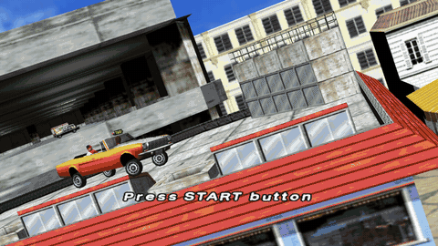
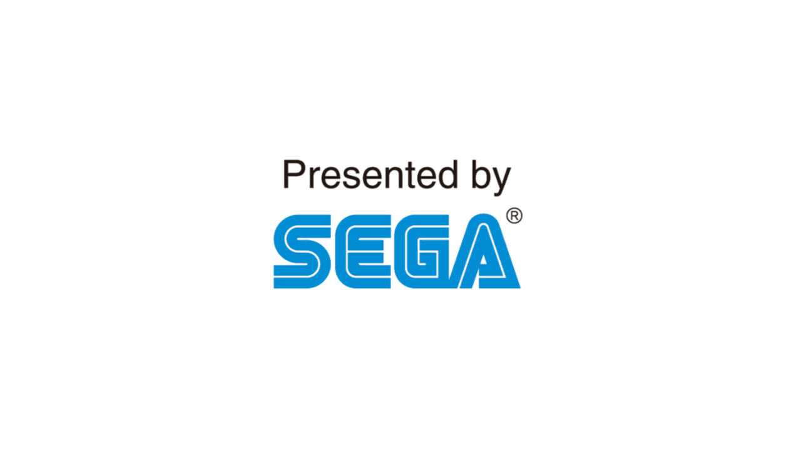
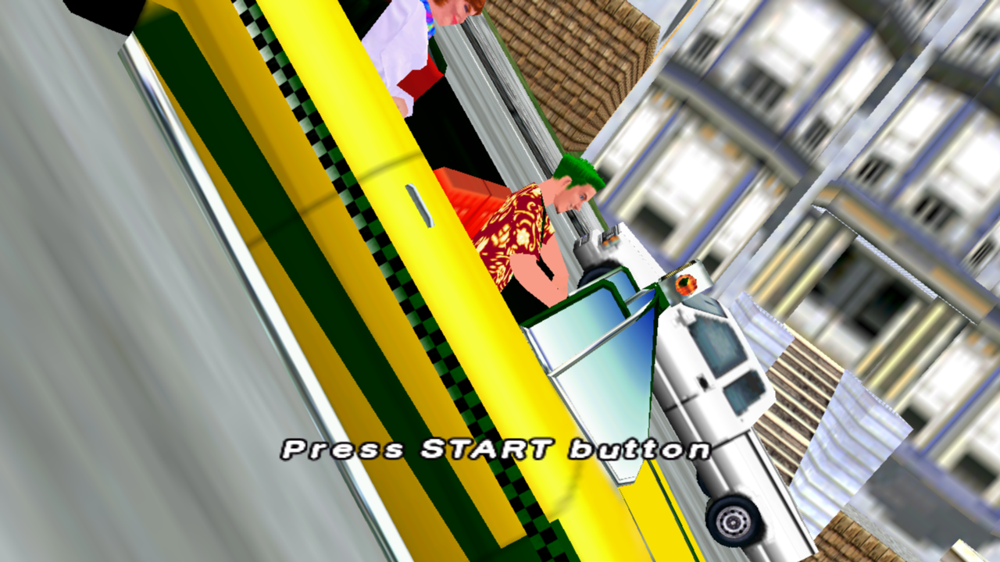

# crazytaxi-ps3 — Crazy Taxi (PS3), static recompilation

`NPUB30242`, the 2010 PSN release (Sega), a port of the Dreamcast game.
Recompiled to native Windows with [ps3recomp](https://github.com/sp00nznet/ps3recomp)
and built in its shared house style, like its sister ports
[gh3](https://github.com/sp00nznet/gh3) and
[simpsonsarcade-ps3](https://github.com/sp00nznet/simpsonsarcade-ps3).

Crazy Taxi has two other recompilations here: the Dreamcast SH-4 original
([crazytaxi](https://github.com/sp00nznet/crazytaxi)) and the Xbox 360 XBLA build
([ctxbla](https://github.com/sp00nznet/ctxbla)).



| | |
|---|---|
|  |  |
|  |  |

## Status

**Alpha.** Boots through the loading screen, ESRB/Sega/CRI logos and the
"Press START" title into the in-engine attract demo, at about 25 fps.
Nothing past the title has been tried yet.

| Area | State |
|---|---|
| PKG extract, EBOOT decrypt | Works (free-license EBOOT; see [docs/extracting.md](docs/extracting.md)) |
| PPU lift | 8,655 functions, 197 imports across 16 libraries, builds first time |
| SPU | 2 embedded images lifted; the CRI task (image 1) dispatches through SPURS |
| Graphics | Logos, title and 2D render. In 3D, large parts of the city draw black |
| Audio | CRI ADX sound bank loads; output not checked |
| Input | Not tried past the title screen |
| Menus, gameplay | Not reached |

What's next is in [ROADMAP.md](ROADMAP.md), and the per-session log is in
[docs/progress.md](docs/progress.md).

## Getting Started

You need your own copy of the game. No game code, data or keys come with this
repo, and the recompiled source isn't distributed. You generate it locally from
your own dump.

Prerequisites (Windows 11):

- Visual Studio 2022 with the C++ workload and **clang-cl** (LLVM component)
- CMake ≥ 3.20, Ninja, Python 3.11+ with `pycryptodome`
- Git Bash (for `tools/relift.sh`)
- A checkout of [ps3recomp](https://github.com/sp00nznet/ps3recomp) with
  `build-gate/ps3recomp_runtime.lib` built (default path `G:/recomp/ps3`; set
  `PS3RECOMP_DIR` for CMake and `PS3RECOMP` for `relift.sh` if yours is elsewhere)
- A scetool-format key file holding the NPDRM `appldr` keys and `NP_klic_free` / `NP_klic_key`

Steps:

1. Put the game's PKG(s) in `pkg/` and build the disc tree in `vfs/PS3_GAME/`,
   then decrypt the EBOOT to `game/EBOOT.elf`. The exact commands, and why the
   retail EBOOT needs a RAP, are in [docs/extracting.md](docs/extracting.md).
2. Lift and generate: `./tools/relift.sh` (writes
   `imports.json`, `analysis/`, `src/recomp/`, `src/gen/`, `src/spu_gen/`).
3. Build: `python build.py` (configures CMake + Ninja under the MSVC
   environment and builds `build/crazytaxi.exe`, Release).
4. Run:

   ```bash
   PS3_VFS_ROOT=vfs RSX_LIVE_DRAW=1 PS3_MAIN_STACK_LV2=1 \
       ./build/crazytaxi vfs/PS3_GAME/USRDIR/EBOOT.elf
   ```

   A 1280x720 window opens. It shows "NOW LOADING", the ESRB, Sega and CRIWARE
   logos, then the title screen. Leave it at the title and the
   attract demo starts. The window title shows FPS, draws per frame and size.

## Usage

Headless capture, pressing START at 30 s and dumping every 120th frame:

```bash
mkdir -p scratch/frames
PAD_SCRIPT="30:0x0008" LD_FRAME_DUMP=scratch/frames LD_FRAME_DUMP_EVERY=120 \
PS3_VFS_ROOT=vfs RSX_LIVE_DRAW=1 PS3_MAIN_STACK_LV2=1 \
    ./build/crazytaxi vfs/PS3_GAME/USRDIR/EBOOT.elf
```

`LD_FRAME_DUMP`'s directory has to exist before the run, or nothing is written.
Pad masks: START `0x0008`, CROSS `0x4000`.

## Building from source

Steps 2 and 3 above. Run `tools/relift.sh` again whenever ps3recomp's lifter
changes. Run `python build.py` again when the runtime library or this repo
changes. `--code-end 0x2A2598` in `relift.sh` matters: it sits just past the
`.lib.stub` trampolines, and `.rodata` follows in the same executable segment.

## License

[MIT](LICENSE), covering this repo's own build scripts and docs. Crazy Taxi is
© Sega. The screenshots and GIF are from the running recompilation and are here
only to show progress.
