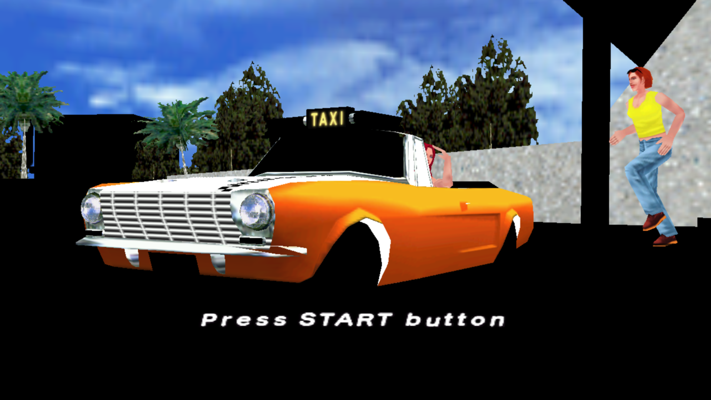
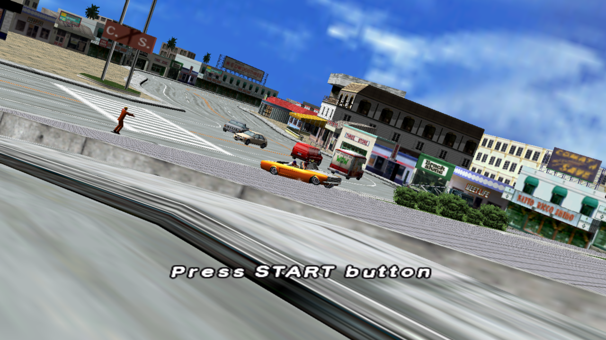
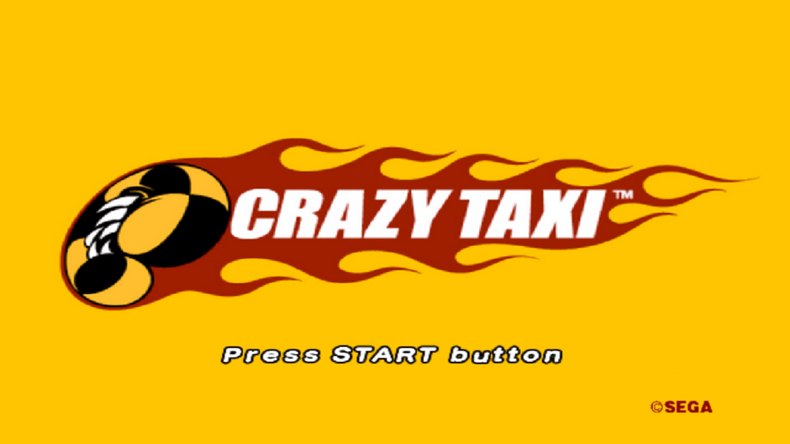

# Progress log

Newest first. Runtime fixes land in [ps3recomp](https://github.com/sp00nznet/ps3recomp)
unless noted.

## 2026-09-27: the city renders, no more flashes

| Before | After |
|---|---|
|  |  |

| Symptom | Cause |
|---|---|
| Large parts of the 3D city drew black | The city's pixel shader is an uber-shader with if/else blocks, and the FP decompiler skipped every flow-control instruction. Both sides of each if/else ran, and the later one overwrote the lit colour with `COLOR0`, which the city's vertex program (position + UV only) never writes. IFE/LOOP/REP/BRK and LIF are now decompiled (ps3recomp [#187](https://github.com/sp00nznet/ps3recomp/pull/187)) |
| About one frame in six presented black | `_cellGcmSetFlipCommand` flipped at call time, before the frame's final composite draw had been drained: 9.9% of presents showed a display buffer cleared after its last draw. PR [#185](https://github.com/sp00nznet/ps3recomp/pull/185) (written for Simpsons) queues the flip in the FIFO. With it, 0 of 1,280 presents and 0 of 230 dumped frames were black |

How it was found, in case the next black surface looks similar:

1. `LD_NO_DEPTH=1`: the sky appeared and painted over everything, but the
   early city draws were still black on black. So it wasn't depth.
2. `LD_DRAW_DUMP` every 50 draws through one frame put the sky at draw ~400 and
   the city before it. The black areas are silhouettes: the geometry is drawn,
   just shaded black.
3. `LD_FORCE_COL0=1` (vertex-shader COLOR0 forced white) brought the whole city
   back, textured. So the colour input was the culprit.
4. `LD_HLSL_DUMP`: the vertex program never writes `o[1]`, and the pixel shader
   read `input.col0` right after `/* TODO: branch/flow-control op skipped */`.

Both fixes together are all this title needs from ps3recomp: it runs on clean
`origin/master` + those two branches, without the Tornado-era uncommitted work.

## 2026-09-26: day one, title screen and attract demo

Lift and build went through the first time with nothing title-specific:
8,655 functions, 197 imports across 16 libraries, two embedded SPU images
(43 KB and 159 KB), built against the ps3recomp runtime as it stood for
Tornado Outbreak that day.

First boot runs the whole front end with no fixes:

- "NOW LOADING", then the ESRB, Sega and CRIWARE logos, then the title
- CRI ADX starts its four threads, loads the sound-effect bank
  (`sounddata/adx/*.adx`, `sedata_adx.dat`) and opens the music tracks
- SPURS: one taskset, one task, SPU image 1, dispatched to the lifted code
  (`fp=0x53FCAE2F891FFB02`). Image 0 hasn't been used yet
- Trophy context registered ("Checking Trophy data." dialog opens and closes)
- The attract demo plays in-engine at about 25 fps



A 100 s run with `RSX_LIVE_DRAW=1`, cumulative at frame 2784:

```text
groups[seen=457971 exec=451293 empty=0 drop{fetch=0 degen=0 prim=6678 alloc=0 pso=0 ring=0 surface=0}]
textures[cached=559/1024 full=0 decodefail=0]
```

| Symptom | Where it stands |
|---|---|
| Large parts of the 3D city draw black (buildings, road) | Fixed 2026-09-27, see above: FP flow control, not the `prim` drops. 1.5% of draw groups still drop on `prim` (a primitive the live engine doesn't expand); nothing visibly missing |
| `open FAILED: vfs\USRDIR\config.txt`, `song01.afs` | Neither file ships in the PSN build, and `song01.afs` is a Dreamcast-era name. The music the game plays opens from `sounddata/music_adx/` (`radiator.adx`, `orange_wednesday.adx`) |
| RSX methods `0x0194`, `0x018C`, `0x01B4`, `0x01B8`, `0x0198` (all `0xFEED0000`), `0x02B8`, `0x1D88`, `0x1D7C`, `0x0394`, `0x0398` unknown | 3–6 times each in a run, during setup. Not yet checked |
